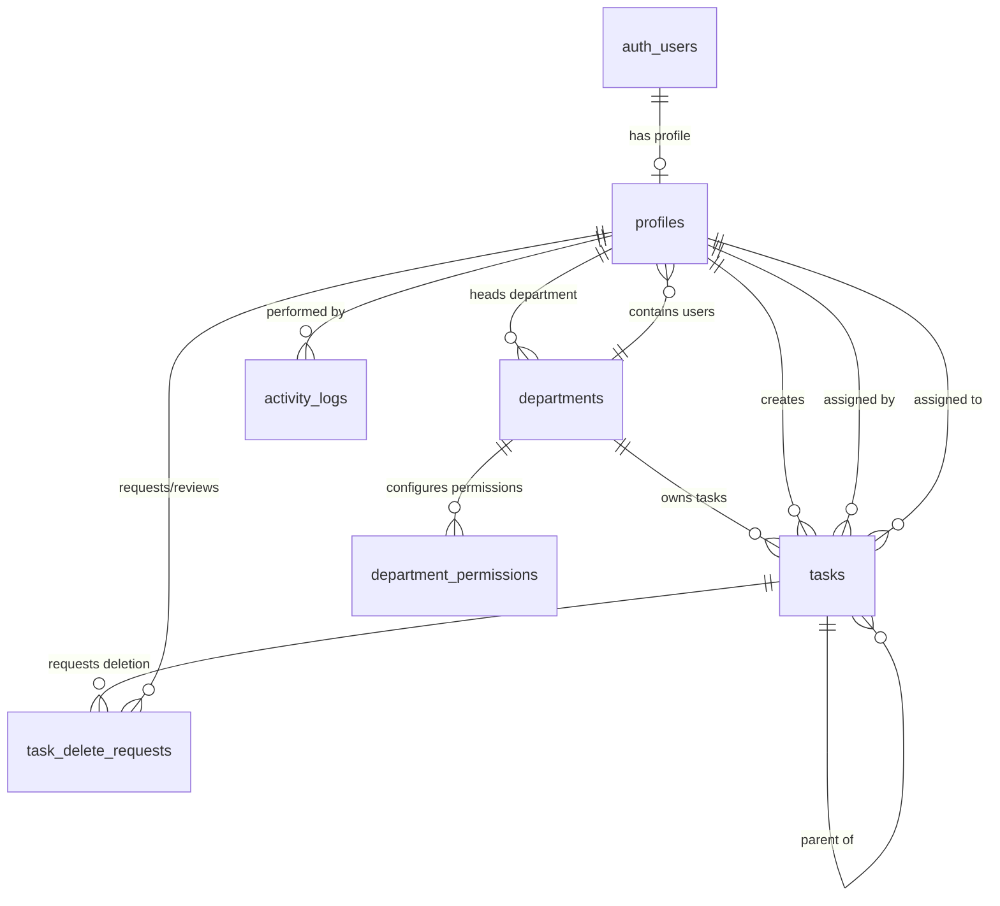

# UPCOMM Solutions Task Manager 02 — Complete Merged Product Requirements & Implementation Plan

**Version:** Complete merged PRD incorporating the original implementation plan and the revised Admin → HOD → Team Member workflow with hidden IT Support Admin support account.

---

## 1. Product Overview

UPCOMM Solutions Task Manager 02 is an internal role-based task management portal for managing departments, users, assignments, deadlines, task status, team workload, performance, and system administration.

The application will be built as a responsive SaaS-style web application using React and Supabase.

The final system contains four role experiences:

1. **Admin**
2. **Department Head / HOD**
3. **Team Member**
4. **IT Support Admin**

The primary work hierarchy is:

**Admin → HOD → Team Member**

An Admin-created business task must be assigned to the selected department's HOD. The HOD receives that task and can create/assign work to Team Members inside the same department. Team Members can view tasks assigned to them and tasks they create for themselves.

The IT Support Admin is a hidden support/system account with full system access but is excluded from normal people directories and application activity logging.

---

## 2. Core Product Goals

The portal must:

- Centralize task management across all UPCOMM departments.
- Provide clear responsibility from management to HOD to Team Member.
- Give Admin a complete organization-wide overview.
- Give HODs complete visibility into their own department.
- Give Team Members a focused personal task workspace.
- Surface upcoming due and overdue work before deadlines are missed.
- Support controlled department/user creation and permissions.
- Maintain application activity logs for normal operational users.
- Preserve task history through soft deletion rather than hard deletion.
- Allow profile pictures to be consistently visible throughout the portal.
- Allow Admin-created users to log in immediately without email confirmation.
- Prompt default-password users to change their password without blocking portal access.
- Provide a hidden IT Support Admin account for maintenance and troubleshooting.

---

## 3. Technical Overview & Stack

### Frontend

- React 18
- Vite
- Tailwind CSS
- Lucide React Icons
- React Router v6
- TanStack Query and/or custom Supabase hooks
- React Hook Form
- Zod validation

### Backend & Database

- Supabase PostgreSQL
- Supabase Auth
- Supabase Row Level Security (RLS)
- Supabase Storage
- Supabase Realtime where useful
- Supabase Edge Functions or another trusted server endpoint for privileged user-creation actions

### Design System

- Light SaaS theme
- Primary app background around `#F8FAFC`
- Soft pastel status badges
- Soft pastel priority badges
- Soft red overdue state around `#FEF2F2`
- Responsive desktop sidebar
- Mobile drawer navigation
- Mobile-friendly card views for tables/tasks
- Reusable UI primitives for badges, buttons, modals, tables, avatars, alerts, filters and loaders

---

## 4. Final Role Model

The old generic two-role model (`admin` and `department_user`) is replaced by four explicit roles:

```text
admin
hod
team_member
it_support_admin
```

Role security must be implemented at both application and database/RLS level.

---

## 5. Admin Role

Admin has full business and management access to the portal.

### Admin Can

- View all portal pages.
- View all departments.
- View all HODs and Team Members.
- View all normal user profiles.
- View all tasks across the organization.
- View organization-wide statistics and performance.
- Create departments.
- Edit departments.
- Activate/deactivate departments.
- Create users.
- Assign users to departments.
- Assign/change a department HOD.
- Activate/deactivate users.
- Manage roles and permissions.
- Create business tasks for any department.
- Edit/reassign/manage tasks.
- Review department performance.
- Review HOD workload.
- Review Team Member workload.
- View due-soon and overdue tasks.
- View normal user activity logs.
- Manage settings and integrations.
- Review task deletion requests.
- Approve/reject task deletion requests.
- Upload/update profile images where administrative support is required.

### Admin Task Assignment Rule

When Admin creates a normal business task:

- Admin selects the target department.
- The system resolves the active HOD of that department.
- The task is assigned to the HOD.
- Admin does not directly assign that normal Admin-created task to a Team Member.

If the selected department has no active HOD, the system must prevent task creation and show a clear validation message.

---

## 6. Department Head / HOD Role

The HOD is responsible for one department and receives department-level work from Admin.

### HOD Can

- Receive tasks created by Admin for their department.
- View tasks assigned to them by Admin.
- View all non-deleted tasks belonging to their own department.
- View department-level KPIs.
- View department task status breakdown.
- View overdue tasks.
- View upcoming due tasks.
- Receive due-soon alerts.
- Create tasks for Team Members in their own department.
- Assign work only to active Team Members from their own department.
- Edit/manage permitted department tasks.
- Update status of tasks assigned to them.
- View their own department Team Members.
- View member-wise workload and task counts.
- View recent department tasks.
- View high/urgent priority work.
- Manage their own profile and profile picture.
- Change their password.
- Request task deletion where permission allows.

### HOD Cannot

- Access another department's private task data.
- Assign tasks to Team Members from another department.
- Manage global departments unless Admin explicitly allows it.
- Manage global application settings unless explicitly allowed.
- Access organization-wide user data beyond the permitted department scope.
- Bypass RLS using frontend changes.

---

## 7. Team Member Role

Team Member access is intentionally personal and task-focused.

### Team Member Can

- View tasks assigned to them by their HOD.
- View tasks created by themselves for themselves.
- Create personal tasks.
- Update permitted fields/status of their own assigned tasks.
- Update permitted fields/status of their personal tasks.
- View personal KPI cards.
- View personal due-soon alerts.
- View personal overdue tasks.
- View today's/upcoming tasks.
- View high/urgent priority tasks assigned to them.
- Manage their own profile.
- Upload/change their own profile picture.
- Change their password.
- Request deletion of eligible tasks if the permission is enabled.

### Team Member Cannot

- View another Team Member's private task list.
- Assign tasks to another Team Member.
- Create department-wide tasks.
- Access another department's private data.
- Manage departments.
- Manage users and roles.
- View global Team Directory if this page is not exposed to members.
- View Admin activity logs.
- Manage global permissions or settings.

---

## 8. IT Support Admin Role

IT Support Admin is a hidden support/system account with Admin-equivalent functional access.

### IT Support Admin Seed Account

- **Email:** `ranahamza241203@gmail.com`
- **Default Password:** `123456`
- **Role:** `it_support_admin`

### IT Support Admin Can

- Access all application pages.
- Access all departments.
- Access all tasks.
- Access Users & Roles for troubleshooting.
- Access Team Directory for troubleshooting.
- Access settings and integrations.
- Access security/configuration pages.
- Perform Admin-level support actions.
- Create/edit tasks if necessary for support.
- Access global system data required for troubleshooting.

### Hidden IT Support Rules

The IT Support Admin account must:

- **NOT appear in Team Directory.**
- **NOT appear as a row/card in Users & Roles.**
- **NOT be counted in normal staff/team/member counts.**
- **NOT appear in normal people search/autocomplete unless a support-only flow explicitly requires it.**
- **NOT generate records in the application's `activity_logs` table.**
- **NOT appear in portal activity feeds.**
- Be marked internally as a system/support account.

These rules must be enforced in backend/database query logic and not only hidden through CSS.

### Security Note

The support account should be seeded/created server-side. The Supabase service-role key must never be exposed in the React frontend bundle.

---

## 9. Authentication Flow

### Login

All users log in using Email + Password through Supabase Auth.

### Removed Email Confirmation System

The account/email confirmation workflow is removed for Admin-created portal users.

When Admin creates a user:

- Create the Supabase Auth user server-side.
- Automatically mark the email as confirmed.
- Do not send an email confirmation message.
- Do not send a welcome/setup email.
- Do not require the user to click any activation link.
- Immediately create the matching profile row.
- Assign the selected role and department.
- Set default password to `123456`.
- Set `must_change_password = true`.
- User can immediately log in.

### Trusted User Creation

User creation must be executed through a trusted backend route, Supabase Edge Function, or server function using the Supabase Admin API.

Do not expose privileged Supabase keys in client-side React code.

---

## 10. Default Password & Password Change Alert

### Default Password

The standard default password for newly created users is:

```text
123456
```

### Password Alert Behavior

The previous blocking Force Password Reset page is replaced by a global non-blocking alert.

If:

```text
must_change_password = true
```

show a visible alert throughout the authenticated portal, for example:

> You are using the default password. Please change your password.

The alert should include a direct **Change Password** action.

### After Password Change

After Supabase successfully changes the password:

1. Update `profiles.must_change_password = false`.
2. Refresh/update local profile state.
3. Automatically hide the warning immediately.
4. Do not display it on future logins unless the flag is set back to true by an authorized process.

The user is not blocked from using the portal while the alert is visible.

---

## 11. Profile Picture System

Profile pictures are stored in Supabase Storage.

### Recommended Bucket

```text
profile-pictures
```

### Profile Picture Rules

- Each profile contains an `avatar_url` or storage path.
- A user can upload/change their own profile picture.
- Admin may update user profile pictures where needed.
- IT Support Admin may update them for support purposes.
- Storage policies must restrict unauthorized writes.
- Authenticated users may read avatars required by permitted application screens.
- If no picture exists, show initials/avatar fallback.

### Avatar Must Appear Everywhere the User Is Represented

Use one reusable `Avatar` component in:

- Header/topbar
- Sidebar profile section
- Dashboard welcome card
- Profile page
- Team Directory
- Users & Roles
- Department member list
- Task cards
- Task detail page
- Assigned To area
- Assigned By area
- Created By area
- Activity log rows for visible users
- User dropdowns
- Assignee selectors
- Department/HOD selectors where applicable

IT Support Admin remains excluded from normal people listings even if it has an avatar.

---

## 12. Department Management

Admin manages departments.

### Department Fields

- Name
- Description
- Color
- Icon
- Active status
- HOD
- Created by
- Created at
- Updated at

### Department Actions

Admin can:

- Create department
- Edit department
- Activate/deactivate department
- Change color/icon
- Assign HOD
- Change HOD
- View department members
- View department performance
- View department tasks
- Manage department permissions

### HOD Business Rule

By default, each active department has one active HOD.

Multi-HOD support is not part of the base scope unless explicitly added later.

---

## 13. User Management

### Add User Form

Admin enters:

- Full Name
- Email
- Role
- Department where required

The default password is not manually entered; it is automatically set to `123456`.

### Role Options

Normal Admin-created staff roles:

- HOD
- Team Member

Admin role creation can be separately permission-controlled if required.

IT Support Admin is a system-seeded/support-managed account and should not normally be created through the regular Add User UI.

### User Management Actions

Admin can:

- Create user
- Edit name/profile information
- Change department
- Change role
- Activate/deactivate account
- Assign/unassign HOD responsibility
- Reset password through a secure administrative process if later implemented
- Update avatar where needed

---

## 14. Task Management Engine

The task engine retains automatic task numbering and adds explicit assignee hierarchy.

### Task Number

Human-readable unique task numbers:

```text
TM-0001
TM-0002
TM-0003
```

Generate using a PostgreSQL sequence or safe transactional function.

### Task Fields

- Task Number
- Title
- Description (optional)
- Department
- Created By
- Assigned By
- Assigned To
- Parent Task (optional)
- Task Origin
- Start Date
- Due Date
- Priority
- Status
- Completed At
- Is Deleted
- Deleted At
- Deleted By
- Created At
- Updated At

### Priority Values

- Low
- Medium
- High
- Urgent

### Status Values

- Pending
- In Progress
- Completed

Overdue is calculated from due date/status and does not have to be stored as a permanent status value.

---

## 15. Task Origin Types

Use a field such as `task_origin` with values:

```text
admin_to_hod
hod_to_member
member_personal
support
```

### `admin_to_hod`

Admin-created organizational task assigned to target department HOD.

### `hod_to_member`

HOD-created task assigned to a Team Member of the same department.

### `member_personal`

Personal task created by a Team Member and assigned to themselves.

### `support`

Optional internal type for IT Support operations where a task record is needed.

---

## 16. Admin-Created Task Flow

1. Admin opens **Create Task**.
2. Admin enters Title.
3. Admin enters optional Description.
4. Start Date defaults to current date but can be editable according to configuration.
5. Admin selects Due Date.
6. Validate `due_date >= start_date`.
7. Admin selects Priority.
8. Admin selects target Department.
9. System resolves the active HOD for that department.
10. `assigned_to` is automatically set to the HOD.
11. `assigned_by` is Admin.
12. `created_by` is Admin.
13. `task_origin = admin_to_hod`.
14. Task appears on HOD Dashboard.
15. Task appears in Department Tasks.
16. Task appears in Admin global task views.

If no active HOD exists, prevent submission and show a validation message such as:

> This department does not have an active HOD. Assign an HOD before creating a department task.

---

## 17. HOD-Created Team Task Flow

1. HOD opens **Create Team Task**.
2. Department is automatically locked to HOD's department.
3. HOD enters Title.
4. HOD enters optional Description.
5. HOD selects dates and priority.
6. Assignee selector lists only active Team Members from the same department.
7. HOD selects a Team Member.
8. `created_by = HOD`.
9. `assigned_by = HOD`.
10. `assigned_to = selected Team Member`.
11. `task_origin = hod_to_member`.
12. Task appears on Team Member Dashboard.
13. Task remains visible in HOD Department Dashboard.
14. Task remains visible to Admin.

HOD cannot select a user from another department.

---

## 18. Team Member Personal Task Flow

1. Team Member opens **Create Personal Task**.
2. Department is locked to their own department.
3. Assignee is locked to the logged-in Team Member.
4. Team Member enters task information.
5. `created_by = auth.uid()`.
6. `assigned_by = auth.uid()`.
7. `assigned_to = auth.uid()`.
8. `task_origin = member_personal`.
9. Task appears in My Tasks.
10. Task contributes to personal dashboard metrics.
11. Task remains visible to HOD/Admin for permitted department/management oversight.

Team Member cannot select another assignee.

---

## 19. Parent Task / Work Breakdown Traceability

Add optional:

```text
parent_task_id
```

This allows an HOD-created Team Member task to be linked to the original Admin task if work breakdown traceability is desired.

Example:

```text
Admin Task TM-0100
└── HOD Team Task TM-0101
    ├── Team Task TM-0102
    └── Team Task TM-0103
```

The base system can support the field even if the UI initially treats it as optional.

---

## 20. Task List & Filtering

Task lists should support:

- Search text
- Department
- Assignee
- Created By
- Status
- Priority
- Start date range
- Due date range
- Due Soon
- Overdue

### Admin Task List

Can view/filter all non-deleted tasks.

### HOD Task List

Scoped to the HOD's department.

### Team Member Task List

Only tasks where:

```text
assigned_to = current user
OR created_by = current user
```

### IT Support Task List

Admin-equivalent access for support purposes.

---

## 21. Due Soon & Overdue Logic

### Overdue

A task is overdue when:

```text
due_date < current_date
AND status != completed
AND is_deleted = false
```

### Due Soon

A task is due soon when it is not completed and its due date falls within the configured upcoming window.

Recommended initial window:

```text
3 days
```

This can later become configurable in App Settings.

### Visual Treatment

- Overdue rows/cards: soft red background, e.g. `#FEF2F2`.
- Due Soon: warning badge/alert.
- Urgent priority: high-emphasis badge.

---

## 22. Admin Dashboard

Admin Dashboard is organization-wide.

### KPI Cards

- Total Tasks
- Completed
- Pending
- In Progress
- Overdue
- Due Soon

### Department Performance

Show department-wise:

- Total Tasks
- Completed
- Pending
- In Progress
- Overdue
- Completion rate
- Due Soon

Department rows/cards should support click-to-filter/drill-down.

### Additional Admin Sections

- HOD workload overview
- Team performance overview
- Overdue Tasks table
- Due Soon tasks
- High/Urgent priority tasks
- Recent visible activity
- Department filters
- Status filters
- Priority filters
- Date filters

---

## 23. HOD / Department Dashboard

HOD Dashboard is scoped to the logged-in HOD's department.

### KPI Cards

- Tasks Assigned to Me by Admin
- Total Department Tasks
- Completed
- Pending
- In Progress
- Overdue
- Due Soon

### HOD Sections

- Upcoming Due Tasks alert
- Overdue task section
- My Team workload
- Member-wise task counts
- Team Member completion status
- Recent department tasks
- High/Urgent tasks
- Quick Create Team Task

The HOD must never receive another department's private task data through queries or RLS.

---

## 24. Team Member Dashboard

Team Member Dashboard contains personal task information.

### KPI Cards

- Total My Tasks
- Assigned to Me
- Personal Tasks
- Completed
- Pending
- In Progress
- Overdue
- Due Soon

### Team Member Sections

- Today's Tasks
- Upcoming Tasks
- Due Soon Alert
- High/Urgent Priority Tasks
- Recent Tasks
- Quick Create Personal Task

No other Team Member's private task data should be exposed.

---

## 25. IT Support Admin Dashboard

IT Support Admin gets a dedicated support dashboard route while reusing Admin components where appropriate.

### Recommended Sections

- Global task KPIs
- Department metrics
- User/system status
- Overdue tasks
- Due Soon tasks
- System/configuration shortcuts
- Integrations status
- Support-oriented links to Admin modules

### Hidden Metrics Rule

The IT Support account itself should not be included in normal people counts, team directories, employee lists or user-role totals intended for business users.

---

## 26. Delete Request & Soft Delete Workflow

The original PRD's task delete request and soft-delete mechanism is retained.

The removed **confirmation system** refers to user email/account confirmation. Task deletion remains a separate controlled workflow.

### Department/HOD/Member Delete Request

1. User opens eligible task.
2. Selects **Request Delete**.
3. Enters reason.
4. System creates `task_delete_requests` record with `pending` status.
5. Admin reviews request.
6. Admin approves or rejects.

### On Approval

Do not hard-delete the task.

Set:

```text
is_deleted = true
deleted_at = now()
deleted_by = reviewer id
```

### Benefits

- Auditability
- Recovery potential
- Reporting consistency
- Prevents accidental permanent deletion

Normal non-Admin users have no hard DELETE permission.

---

## 27. Dynamic Permission Engine

Keep the original department permission matrix, but permissions may only narrow/extend allowed UI behavior within the boundaries established by RLS and base roles.

Possible permission keys:

```text
view_dashboard
view_department_tasks
create_team_tasks
edit_department_tasks
request_delete
view_department_stats
view_team_workload
```

### Security Rule

Dynamic permissions are not a replacement for database-level authorization.

RLS remains the primary data security boundary.

---

## 28. Activity Logging

Keep application activity logging for normal operational users.

### Record Activities Such As

- Task creation
- Task edit
- Task assignment/reassignment
- Task status update
- Delete request submission
- Delete approval/rejection
- Department creation/update
- User creation/update
- Role changes
- Permission changes
- Settings changes

### IT Support Suppression Rule

Do not create application `activity_logs` records when the actor:

```text
role = it_support_admin
```

or:

```text
suppress_activity_logging = true
```

This must be enforced in the trusted database/server logging helper, not only in React.

Example logic:

```text
if current_profile.suppress_activity_logging == true:
    return without insert
else:
    insert activity_logs row
```

---

## 29. Team Directory & Users & Roles Visibility

Normal people lists can include:

- Admin users if desired by the business UI
- HODs
- Team Members

Always exclude profiles where:

```text
exclude_from_directory = true
```

### IT Support Must Be Excluded From

- Team Directory
- Users & Roles main user list
- Department staff counts
- Employee/member cards
- Normal people search
- Normal user totals
- Organization directory widgets

When the IT Support Admin is logged in, their own private account/profile menu can still show their identity so they can manage their own password/profile.

---

## 30. Proposed Database Architecture

### Relationships



---

## 31. `profiles` Table

Recommended fields:

```text
id uuid primary key references auth.users(id) on delete cascade
email text unique not null
full_name text not null
role text/enum not null
  admin
  hod
  team_member
  it_support_admin
department_id uuid nullable references departments(id)
reports_to uuid nullable references profiles(id)
avatar_url text nullable
is_active boolean default true
must_change_password boolean default true
is_system_account boolean default false
exclude_from_directory boolean default false
suppress_activity_logging boolean default false
created_at timestamptz
updated_at timestamptz
```

### IT Support Flags

```text
is_system_account = true
exclude_from_directory = true
suppress_activity_logging = true
```

---

## 32. `departments` Table

Recommended fields:

```text
id uuid primary key default gen_random_uuid()
name text unique not null
description text
color text
icon text
hod_id uuid nullable references profiles(id)
is_active boolean default true
created_by uuid references profiles(id)
created_at timestamptz
updated_at timestamptz
```

---

## 33. `tasks` Table

Recommended fields:

```text
id uuid primary key default gen_random_uuid()
task_number text unique not null
title text not null
description text nullable
department_id uuid references departments(id)
created_by uuid references profiles(id)
assigned_by uuid references profiles(id)
assigned_to uuid references profiles(id)
parent_task_id uuid nullable references tasks(id)
task_origin text/enum
start_date date
due_date date
priority text/enum
status text/enum
completed_at timestamptz nullable
is_deleted boolean default false
deleted_at timestamptz nullable
deleted_by uuid nullable references profiles(id)
created_at timestamptz
updated_at timestamptz
```

### Priority Constraint

```text
low | medium | high | urgent
```

### Status Constraint

```text
pending | in_progress | completed
```

### Task Origin Constraint

```text
admin_to_hod | hod_to_member | member_personal | support
```

---

## 34. `task_delete_requests` Table

Recommended fields:

```text
id uuid primary key default gen_random_uuid()
task_id uuid references tasks(id)
requested_by uuid references profiles(id)
department_id uuid references departments(id)
reason text
status text/enum
  pending
  approved
  rejected
reviewed_by uuid nullable references profiles(id)
reviewed_at timestamptz nullable
created_at timestamptz
```

---

## 35. `department_permissions` Table

Recommended fields:

```text
id uuid primary key default gen_random_uuid()
department_id uuid references departments(id)
permission_key text
enabled boolean default true
created_at timestamptz
updated_at timestamptz
```

---

## 36. `activity_logs` Table

Recommended fields:

```text
id uuid primary key default gen_random_uuid()
user_id uuid references profiles(id)
action text
entity_type text
entity_id uuid nullable
metadata jsonb
created_at timestamptz
```

All trusted activity insert paths must check the support-account suppression flags before writing.

---

## 37. `app_settings` Table

Use a system-wide settings table for values such as:

- App title
- Company name
- Timezone
- Date format
- Due Soon window
- Default interface preferences
- Security options
- Feature flags

---

## 38. `integrations` Table

Use for integration/provider status and configuration metadata.

Do not store secrets directly where normal client-side queries can expose them.

Possible fields:

- Provider
- Display Name
- Enabled
- Status
- Non-sensitive metadata
- Updated At

Sensitive credentials should use secure server-side secret storage.

---

## 39. Supabase Storage Structure

Recommended bucket:

```text
profile-pictures
```

Recommended object path pattern:

```text
profile-pictures/{user_id}/{filename}
```

Storage policies should allow:

- User writes to own avatar path.
- Admin/support writes when authorized.
- Read access only as required by the authenticated application.

---

## 40. Row Level Security — General Principles

All sensitive tables must have RLS enabled.

Frontend route guards improve UX but do not replace RLS.

Security decisions must be derived from the authenticated user's `profiles` row.

---

## 41. Admin RLS

Admin may:

- SELECT all business data.
- INSERT permitted business data.
- UPDATE permitted business data.
- Execute authorized management flows.

Task creation business rules still require Admin-created normal work to resolve to the department HOD.

Hard task deletion should generally remain disabled in favor of soft delete.

---

## 42. IT Support Admin RLS

IT Support Admin receives Admin-equivalent data access.

Additional rules:

- Hidden from normal people-list queries.
- Suppressed from application activity logging.

RLS alone may not hide the support profile from every support-capable query; use secure views/functions/query filters as appropriate for directory/listing behavior.

---

## 43. HOD RLS

HOD may SELECT:

- Own profile.
- Team Members in their own department where required.
- All non-deleted tasks belonging to their own department.
- Relevant department data.

HOD may INSERT a Team Member task only when:

```text
department_id = current_profile.department_id
assigned_to belongs to current_profile.department_id
assigned_to.role = team_member
```

HOD may update only permitted tasks/fields within their department.

HOD cannot access another department through direct URL/API manipulation.

---

## 44. Team Member RLS

Team Member may SELECT tasks where:

```text
assigned_to = auth.uid()
OR created_by = auth.uid()
```

Team Member may INSERT personal tasks only when:

```text
created_by = auth.uid()
assigned_by = auth.uid()
assigned_to = auth.uid()
department_id = current_profile.department_id
```

Team Member cannot assign a task to another user.

Team Member cannot directly query another Team Member's private tasks.

---

## 45. Soft Delete RLS

Normal HOD and Team Member roles:

- No hard DELETE permission on tasks.
- Can create delete requests only where allowed.

Admin approval updates the task soft-delete fields.

---

## 46. Authentication Context

`AuthContext.jsx` should manage:

- Login
- Logout
- Session refresh
- Current Supabase user
- Current profile
- Current role
- Department
- `must_change_password`
- Avatar/profile state
- Account active status

On session creation, load the profile before rendering role-protected application screens.

---

## 47. Route Security

Use:

```text
ProtectedRoute
RoleRoute
```

### Examples

- `/app/admin/*` → Admin/IT Support only
- `/app/hod/*` → HOD plus Admin/support where appropriate
- `/app/team/*` → Team Member personal experience plus management/support impersonation only if later explicitly designed

Unauthorized navigation should redirect to an allowed dashboard or show Access Denied.

Database RLS remains mandatory even if routes are protected.

---

## 48. Role-Based Navigation

### Admin Sidebar

- Dashboard
- All Tasks
- Create Task
- Departments
- Users & Roles
- Team Directory
- Delete Requests
- Activity Logs
- Settings

### HOD Sidebar

- Department Dashboard
- Department Tasks
- Create Team Task
- My Team
- Due Soon / Alerts
- Profile

### Team Member Sidebar

- My Dashboard
- My Tasks
- Create Personal Task
- Profile

### IT Support Admin Sidebar

- Dashboard
- All Tasks
- Create Task
- Departments
- Users & Roles
- Team Directory
- Delete Requests
- Activity Logs
- Settings

IT Support can open directory/user-management pages but its own profile is excluded from those normal listings.

---

## 49. Responsive Shell Layout

### Desktop

- Fixed/collapsible left sidebar
- Header/topbar
- Main content area
- Profile avatar/name in navigation area

### Mobile

- Mobile drawer navigation
- Compact header
- Tables convert to horizontal scroll or task cards
- Filters collapse into sheet/dialog where necessary
- Dashboard KPIs stack responsively

---

## 50. Reusable UI Components

Recommended common components:

```text
Avatar.jsx
Badge.jsx
Button.jsx
Modal.jsx
Table.jsx
LoadingSpinner.jsx
EmptyState.jsx
ConfirmDialog.jsx
```

Dashboard components:

```text
KpiCard.jsx
DueSoonAlert.jsx
DepartmentPerformanceTable.jsx
OverdueTasksList.jsx
TeamWorkloadCard.jsx
```

Task components:

```text
TaskCard.jsx
TaskFilterBar.jsx
TaskStatusBadge.jsx
TaskPriorityBadge.jsx
RequestDeleteModal.jsx
AssigneeSelector.jsx
```

---

## 51. Proposed Project Structure

```text
UPCOMM-SOLUTIONS-TASK-MANAGER-02/
├── supabase/
│   ├── migrations/
│   │   └── 20260815_initial_schema.sql
│   ├── functions/
│   │   └── create-user/
│   └── seed.sql
├── src/
│   ├── assets/
│   ├── components/
│   │   ├── auth/
│   │   │   └── ChangePasswordAlert.jsx
│   │   ├── common/
│   │   │   ├── Avatar.jsx
│   │   │   ├── Badge.jsx
│   │   │   ├── Button.jsx
│   │   │   ├── Modal.jsx
│   │   │   ├── Table.jsx
│   │   │   └── LoadingSpinner.jsx
│   │   ├── layout/
│   │   │   ├── AppLayout.jsx
│   │   │   ├── Header.jsx
│   │   │   ├── Sidebar.jsx
│   │   │   └── MobileDrawer.jsx
│   │   ├── dashboard/
│   │   │   ├── KpiCard.jsx
│   │   │   ├── DueSoonAlert.jsx
│   │   │   ├── DepartmentPerformanceTable.jsx
│   │   │   ├── TeamWorkloadCard.jsx
│   │   │   └── OverdueTasksList.jsx
│   │   ├── tasks/
│   │   │   ├── TaskCard.jsx
│   │   │   ├── TaskFilterBar.jsx
│   │   │   ├── TaskStatusBadge.jsx
│   │   │   ├── TaskPriorityBadge.jsx
│   │   │   ├── AssigneeSelector.jsx
│   │   │   └── RequestDeleteModal.jsx
│   │   └── departments/
│   │       ├── DepartmentCard.jsx
│   │       └── PermissionMatrix.jsx
│   ├── contexts/
│   │   ├── AuthContext.jsx
│   │   └── PermissionContext.jsx
│   ├── hooks/
│   │   ├── useAuth.js
│   │   ├── useProfile.js
│   │   ├── useTasks.js
│   │   ├── useDepartments.js
│   │   ├── useTeamMembers.js
│   │   ├── useDeleteRequests.js
│   │   ├── useActivityLogs.js
│   │   └── useAvatar.js
│   ├── lib/
│   │   └── supabase.js
│   ├── pages/
│   │   ├── auth/
│   │   │   └── Login.jsx
│   │   ├── dashboard/
│   │   │   ├── AdminDashboard.jsx
│   │   │   ├── HODDashboard.jsx
│   │   │   ├── TeamDashboard.jsx
│   │   │   └── ITSupportDashboard.jsx
│   │   ├── tasks/
│   │   │   ├── TaskListPage.jsx
│   │   │   ├── CreateTaskPage.jsx
│   │   │   ├── TaskDetailPage.jsx
│   │   │   └── EditTaskPage.jsx
│   │   ├── departments/
│   │   │   ├── DepartmentListPage.jsx
│   │   │   └── DepartmentDetailPage.jsx
│   │   ├── users/
│   │   │   ├── UserListPage.jsx
│   │   │   └── TeamDirectoryPage.jsx
│   │   ├── delete-requests/
│   │   │   └── DeleteRequestsPage.jsx
│   │   ├── activity/
│   │   │   └── ActivityLogPage.jsx
│   │   ├── profile/
│   │   │   └── ProfilePage.jsx
│   │   └── settings/
│   │       └── SettingsPage.jsx
│   ├── routes/
│   │   ├── ProtectedRoute.jsx
│   │   └── RoleRoute.jsx
│   ├── utils/
│   │   ├── constants.js
│   │   ├── dateUtils.js
│   │   └── taskUtils.js
│   ├── App.jsx
│   ├── main.jsx
│   └── index.css
├── package.json
├── tailwind.config.js
└── vite.config.js
```

---

## 52. Application Settings

Settings can include tabs such as:

### General

- App title
- Company name
- Timezone
- Date format
- Due Soon days

### Permissions

- Department permission matrix
- Feature access

### Integrations

- Provider status
- Integration settings

### Security

- Password-related policies
- Account activation controls
- Other future security settings

---

## 53. Default Departments / Seed Data

The original plan suggested default departments such as:

- Social Media
- Video Editing
- Marketing
- Sourcing
- HR
- Finance
- Procurement

The exact final department list can remain database-driven and editable by Admin.

No department should receive an Admin-created task until it has an active HOD assigned.

---

## 54. Seed Accounts

### Initial Admin

The original implementation plan referenced an initial Admin account:

```text
muhammaddumerr@gmail.com
```

with temporary/default password:

```text
123456
```

If retained as the initial Admin seed, create it server-side and set `must_change_password = true`.

### IT Support Admin

```text
Email: ranahamza241203@gmail.com
Default Password: 123456
Role: it_support_admin
is_system_account: true
exclude_from_directory: true
suppress_activity_logging: true
must_change_password: true
```

---

## 55. User Creation Flow — Detailed

1. Admin opens **Add User**.
2. Enter Full Name.
3. Enter Email.
4. Select Role.
5. Select Department if role requires it.
6. Submit.
7. Trusted backend creates Supabase Auth user.
8. Set default password to `123456`.
9. Set email confirmed automatically.
10. Suppress confirmation/setup email flow.
11. Create `profiles` row.
12. Set role/department.
13. Set `must_change_password = true`.
14. User can immediately log in.
15. Global change-password alert appears.
16. User changes password.
17. Set `must_change_password = false`.
18. Alert disappears automatically.

---

## 56. Task Creation Form Validation

### Shared Fields

- Title required
- Description optional
- Start Date required/defaulted
- Due Date required
- Priority required
- Status defaults to Pending

### Date Validation

```text
due_date >= start_date
```

### Admin Validation

- Department required.
- Department must have active HOD.
- Assignee resolved to HOD.

### HOD Validation

- Department locked to own.
- Assignee required.
- Assignee must be active Team Member in same department.

### Team Member Validation

- Department locked to own.
- Assignee locked to self.

---

## 57. Task Detail Page

Show:

- Task Number
- Title
- Description
- Status
- Priority
- Department
- Start Date
- Due Date
- Created By + avatar
- Assigned By + avatar
- Assigned To + avatar
- Parent Task link if any
- Task Origin
- Created At
- Updated At
- Completed At
- Overdue/Due Soon indicator
- Allowed actions based on role/permissions
- Delete request action where allowed

If task change history/timeline is implemented, show visible normal-user activity only; IT Support activity remains suppressed.

---

## 58. Task Editing

Edit rights depend on role, task ownership, department and permission matrix.

### Admin

Can manage all normal business tasks.

### HOD

Can manage permitted tasks inside own department.

### Team Member

Can manage permitted fields/status of tasks assigned to self or created by self.

### IT Support

Can manage tasks for support purposes with no application activity log generated.

---

## 59. Realtime Updates

Supabase Realtime can be used for:

- New task arrival on HOD Dashboard
- New HOD-assigned task on Team Dashboard
- Status updates
- Delete request status changes
- Dashboard KPI refresh
- Due-alert refresh where appropriate

Realtime remains optional; TanStack Query invalidation can also be used.

---

## 60. Error & Empty States

Provide clear UI for:

- No tasks
- No departments
- Department has no HOD
- No Team Members
- No due-soon tasks
- No overdue tasks
- No activity logs
- Access denied
- Inactive account
- Failed avatar upload
- Failed task creation
- Session expired

---

## 61. Security Requirements

- Never expose Supabase service-role key in frontend.
- Use trusted backend for Admin Auth user creation.
- Enable RLS on sensitive tables.
- Validate role/department on server/database side.
- Hide support account using query/security logic, not CSS only.
- Suppress IT Support activity logs in trusted logging function.
- Restrict storage writes.
- Validate form data with Zod and database constraints.
- Do not rely on route guards as the only authorization mechanism.
- Use soft deletion for tasks.

---

## 62. Step-by-Step Development Plan

### Step 1 — Project Setup & Design System

- Initialize Vite + React.
- Configure Tailwind CSS.
- Add Lucide React.
- Configure global typography/colors.
- Build reusable common components.
- Implement responsive layout shell.

### Step 2 — Database Schema & Supabase Configuration

Create migrations for:

- Profiles
- Departments
- Tasks
- Delete Requests
- Department Permissions
- Activity Logs
- App Settings
- Integrations
- Updated-at triggers
- Task number sequence/function
- RLS policies
- Storage bucket/policies

Seed:

- Initial Admin if required
- IT Support Admin
- Optional default departments
- Default permissions

### Step 3 — Authentication & Profile Loading

- Implement login.
- Implement AuthContext.
- Load profile and role.
- Remove email confirmation UX.
- Build secure Admin user-creation backend function.
- Implement `must_change_password` alert.
- Implement Change Password action.

### Step 4 — Role Security & Navigation

- Implement ProtectedRoute.
- Implement RoleRoute.
- Build role-based sidebar/navigation.
- Implement RLS-aware queries.
- Handle inactive users.

### Step 5 — Department Management

- Department CRUD.
- Icon selector.
- Color picker.
- Active status.
- HOD assignment.
- Department details.
- Department performance.
- Permission matrix.

### Step 6 — User Management & Directory

- Add User.
- Role/department assignment.
- Auto-confirmed Auth user creation.
- Default password.
- Profile picture upload.
- Users & Roles page.
- Team Directory.
- Exclude IT Support account from normal listings/counts.

### Step 7 — Task Engine

- Task numbering.
- Admin → HOD task flow.
- HOD → Team Member task flow.
- Team Member personal task flow.
- Filters/search.
- Status transitions.
- Overdue calculation.
- Due Soon calculation.
- Task detail/edit pages.
- Parent task support.

### Step 8 — Delete Request & Soft Delete

- Request Delete modal.
- Reason field.
- Admin review page.
- Approve/reject.
- Soft delete update.
- Hide deleted tasks from normal lists.

### Step 9 — Dashboards

- Admin Dashboard.
- HOD Dashboard.
- Team Dashboard.
- IT Support Dashboard.
- KPI cards.
- Department performance.
- Team workload.
- Due Soon alerts.
- Overdue lists.

### Step 10 — Activity Logging

- Create trusted activity helper.
- Log normal Admin/HOD/Team actions.
- Suppress IT Support actions.
- Build Activity Log page.

### Step 11 — Settings & Integrations

- General settings.
- Permissions.
- Security.
- Integration status.

### Step 12 — Responsive Polish & QA

- Desktop.
- Tablet.
- Mobile.
- Empty states.
- Loading states.
- Error states.
- Accessibility checks.

---

## 63. Automated / Build Verification

Run:

```text
npm run build
```

Verify:

- JSX compilation
- Tailwind build
- Route imports
- No syntax errors
- No broken environment configuration
- Supabase client query handling

Where test tooling is added, test role guards and utility logic.

---

## 64. Manual Verification — Admin

1. Login as Admin.
2. Confirm global dashboard loads.
3. Create a department.
4. Create/assign an HOD.
5. Create a Team Member in that department.
6. Confirm new user is auto-confirmed.
7. Confirm no confirmation email flow is required.
8. Create Admin task for the department.
9. Confirm task is assigned to HOD only.
10. Confirm Admin can see all tasks/metrics.
11. Confirm overdue and due-soon filters work.
12. Confirm Users & Roles works.
13. Confirm Team Directory works.
14. Confirm IT Support account is not listed.
15. Submit/approve/reject delete requests.
16. Confirm soft delete behavior.

---

## 65. Manual Verification — HOD

1. Login as HOD.
2. Confirm Admin-created task appears.
3. Confirm only own department dashboard data is visible.
4. Confirm department metrics are correct.
5. Confirm upcoming due alert works.
6. Create a task for Team Member in same department.
7. Confirm users from other departments cannot be selected.
8. Confirm Team Member task appears in department overview.
9. Attempt direct URL/query for another department and confirm denial.

---

## 66. Manual Verification — Team Member

1. Login as Team Member.
2. Confirm only assigned/self-created tasks are visible.
3. Confirm another member's task cannot be opened directly.
4. Create personal task.
5. Confirm assignee is automatically self.
6. Confirm department is locked.
7. Update task status.
8. Confirm due-soon and overdue sections are personal-only.

---

## 67. Manual Verification — Password Flow

1. Login using default password `123456`.
2. Confirm change-password alert appears.
3. Confirm rest of portal remains accessible.
4. Change password.
5. Confirm Supabase password update succeeds.
6. Confirm `must_change_password = false`.
7. Confirm alert disappears immediately.
8. Logout/login with new password.
9. Confirm alert does not return.

---

## 68. Manual Verification — IT Support Admin

1. Login as `ranahamza241203@gmail.com`.
2. Confirm Admin-equivalent pages are accessible.
3. Confirm support account is absent from Team Directory.
4. Confirm support account is absent from Users & Roles main list.
5. Confirm support account is absent from normal team counts.
6. Perform task action.
7. Perform user action.
8. Perform settings action.
9. Confirm no application `activity_logs` records are generated for the support actor.
10. Confirm other users' normal actions are still logged.

---

## 69. Manual Verification — Profile Pictures

1. Upload profile picture.
2. Confirm file stores in Supabase Storage.
3. Refresh session/page.
4. Confirm avatar persists.
5. Confirm avatar appears in header.
6. Confirm avatar appears in sidebar.
7. Confirm avatar appears in task cards/details.
8. Confirm avatar appears in permitted people lists.
9. Confirm fallback initials display when no image exists.

---

## 70. Manual Verification — RLS / Data Isolation

### Team Member

Attempt to query another member's tasks directly. Expect denial/no rows.

### HOD

Attempt to query another department's tasks directly. Expect denial/no rows.

### Admin

Confirm global access.

### IT Support Admin

Confirm global support access, with hidden listing/activity behavior preserved.

---

## 71. Final Functional Rules Summary

### Admin

```text
Full portal business access
Creates departments/users
Creates department tasks
Admin task → HOD only
Global dashboards and logs
```

### HOD

```text
Own department access
Receives Admin tasks
Creates tasks for own Team Members
Views department workload and alerts
```

### Team Member

```text
Sees assigned tasks + self-created tasks only
Creates personal tasks for self only
Personal dashboard
```

### IT Support Admin

```text
Admin-equivalent system access
Hidden from Team Directory
Hidden from Users & Roles list
Excluded from normal staff counts
No application activity logging
```

### New Users

```text
Auto-confirmed
No confirmation email
Default password 123456
must_change_password = true
Non-blocking change-password alert
Alert disappears after successful change
```

### Profile Pictures

```text
Stored in Supabase Storage
Reusable Avatar component
Displayed everywhere the user is represented
```

### Task Deletion

```text
Delete request retained
Admin approval/rejection
Soft delete, not hard delete
```

---

## 72. Main Changes From the Original PRD

- Expanded from two roles to four roles.
- Replaced generic `department_user` with `hod` and `team_member`.
- Added dedicated Team Member Dashboard.
- Added dedicated IT Support Admin experience.
- Added Admin → HOD → Team Member assignment hierarchy.
- Added explicit `assigned_to` field.
- Added optional `parent_task_id`.
- Added task origin classification.
- Added HOD workload management.
- Added due-soon alerts.
- Restricted Team Member visibility to personal/assigned tasks.
- Added Team Member personal tasks.
- Removed email/account confirmation workflow.
- Added auto-confirmed Admin-created accounts.
- Standardized default password to `123456`.
- Replaced blocking Force Password Reset page with persistent non-blocking alert.
- Added hidden system-account flags for IT Support Admin.
- Suppressed IT Support Admin activity logging.
- Excluded IT Support Admin from Team Directory and Users & Roles lists.
- Excluded support account from normal staff counts.
- Added Supabase Storage profile pictures.
- Required avatars throughout the portal.
- Retained original soft-delete and delete-request workflow.
- Retained original dynamic permission matrix.
- Retained activity logging for normal users.
- Retained Admin/department performance concepts and expanded them to HOD/member views.
- Retained task numbering, filters, status/priority badges, responsive UI and settings/integrations architecture.

---

## 73. Final Acceptance Criteria

The implementation is considered aligned with this PRD when all of the following are true:

- Admin can access and manage all business modules.
- Admin-created normal tasks always route to target department HOD.
- HOD can create and assign tasks only to Team Members in own department.
- Team Member sees only assigned/self-created tasks and can create self-tasks.
- HOD Dashboard provides department status and upcoming due alerts.
- Team Dashboard provides personal workload and due alerts.
- IT Support Admin has full support access.
- IT Support Admin is hidden from Team Directory and Users & Roles listings.
- IT Support Admin does not create application activity logs.
- Admin-created users are automatically confirmed.
- No confirmation/setup email is required.
- New users use default password `123456`.
- Change-password alert appears while `must_change_password = true`.
- Alert automatically disappears after successful password change.
- Profile images are stored in Supabase Storage and shown consistently across the portal.
- RLS prevents cross-department and cross-user data leakage.
- Task delete requests and soft deletion work.
- Overdue and Due Soon calculations work correctly.
- Application is responsive across desktop, tablet and mobile.
- `npm run build` completes successfully.

---

# End of Complete Merged PRD
