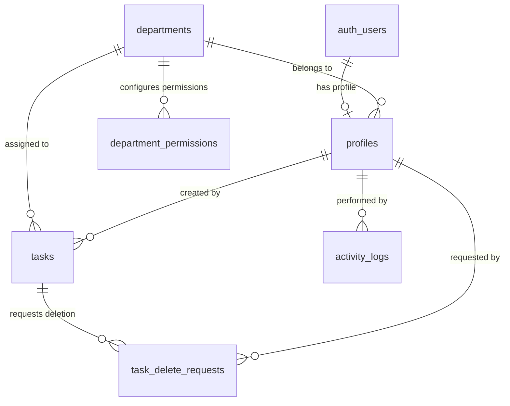

# UPCOMM Solutions Task Manager - Implementation Plan

This implementation plan outlines the architecture, database schema, user roles, security, UI design, and development phases for **UPCOMM Solutions Task Manager 02** based on [`prd.md`](file:///c:/Users/HP840/OneDrive/Documents/GitHub/UPCOMM-SOLUTIONS-TASK-MANAGER-02/prd.md).

---

## Technical Overview & Stack

- **Frontend**: React 18, Vite, Tailwind CSS, Lucide Icons, React Router v6, TanStack Query / Custom Supabase Hooks, React Hook Form, Zod.
- **Backend & Database**: Supabase (PostgreSQL, Auth, Row Level Security, Realtime subscriptions).
- **Design System**: Light SaaS theme, soft pastel status/priority badges, responsive sidebar layout, card view on mobile.
- **Key Modules**:
  1. Authentication & Force-Password-Reset Flow
  2. Role-Based Access Control (Admin vs. Department User)
  3. Dynamic Department Management & User Assignment
  4. Task Management Engine with Automatic Task Numbering (`TM-0001`) & Overdue Auto-calculation
  5. Multi-Step Delete Request & Soft-Delete Workflow
  6. Dynamic Permission Engine & Permission Matrix
  7. Audit & Activity Logging
  8. Admin & Department Performance Dashboards

---

## User Review Required

> [!IMPORTANT]
> **Initial Admin Credentials**: The PRD specifies an initial admin user `muhammaddumerr@gmail.com` with a temporary password (`123456`). We will build a seed script/SQL snippet to create this user, paired with an enforced first-login password reset prompt.

> [!NOTE]
> **Soft Delete Policy**: Tasks will not be hard-deleted from the database when a delete request is approved by an Admin. Instead, `is_deleted = true`, `deleted_at`, and `deleted_by` will be recorded for audit and recovery capabilities.

---

## Open Questions

1. **Supabase Project Details**: Do you have an existing Supabase project URL and anon key ready, or should we set up local database migration SQL scripts (`supabase/migrations/`) ready for you to execute in your Supabase SQL Editor?

---

## Proposed Database Architecture (SQL Schema)

### Tables & Relationships



1. **`profiles`**:
   - `id` (uuid, PK, references `auth.users(id)` ON DELETE CASCADE)
   - `email` (text, unique)
   - `full_name` (text)
   - `role` (text: `'admin'` | `'department_user'`)
   - `department_id` (uuid, references `departments(id)`)
   - `avatar_url` (text)
   - `is_active` (boolean, default `true`)
   - `must_change_password` (boolean, default `false`)
   - `created_at`, `updated_at`

2. **`departments`**:
   - `id` (uuid, PK, default `gen_random_uuid()`)
   - `name` (text, unique)
   - `description` (text)
   - `color` (text, e.g. `'#8B5CF6'`)
   - `icon` (text, e.g. `'Megaphone'`)
   - `is_active` (boolean, default `true`)
   - `created_by` (uuid, references `profiles(id)`)
   - `created_at`, `updated_at`

3. **`tasks`**:
   - `id` (uuid, PK, default `gen_random_uuid()`)
   - `task_number` (text, unique - generated via sequence e.g., `TM-0001`)
   - `title` (text)
   - `description` (text)
   - `department_id` (uuid, references `departments(id)`)
   - `created_by` (uuid, references `profiles(id)`)
   - `assigned_by` (uuid, references `profiles(id)`)
   - `start_date` (date)
   - `due_date` (date)
   - `priority` (text: `'low'` | `'medium'` | `'high'` | `'urgent'`)
   - `status` (text: `'pending'` | `'in_progress'` | `'completed'`)
   - `completed_at` (timestamptz)
   - `is_deleted` (boolean, default `false`)
   - `deleted_at` (timestamptz)
   - `deleted_by` (uuid, references `profiles(id)`)
   - `created_at`, `updated_at`

4. **`task_delete_requests`**:
   - `id` (uuid, PK, default `gen_random_uuid()`)
   - `task_id` (uuid, references `tasks(id)`)
   - `requested_by` (uuid, references `profiles(id)`)
   - `department_id` (uuid, references `departments(id)`)
   - `reason` (text)
   - `status` (text: `'pending'` | `'approved'` | `'rejected'`)
   - `reviewed_by` (uuid, references `profiles(id)`)
   - `reviewed_at` (timestamptz)
   - `created_at`

5. **`department_permissions`**:
   - `id` (uuid, PK)
   - `department_id` (uuid, references `departments(id)`)
   - `permission_key` (text: `'view_dashboard'`, `'view_tasks'`, `'create_tasks'`, `'edit_tasks'`, `'request_delete'`, `'view_department_stats'`)
   - `enabled` (boolean, default `true`)
   - `created_at`, `updated_at`

6. **`activity_logs`**:
   - `id` (uuid, PK)
   - `user_id` (uuid, references `profiles(id)`)
   - `action` (text)
   - `entity_type` (text)
   - `entity_id` (uuid)
   - `metadata` (jsonb)
   - `created_at`

7. **`app_settings`** & **`integrations`**: System-wide configuration table for app title, timezone, date formatting, and API provider status.

---

## Proposed Changes & Application Architecture

### Project Structure

```
UPCOMM-SOLUTIONS-TASK-MANAGER-02/
├── supabase/
│   ├── migrations/
│   │   └── 20260815_initial_schema.sql
│   └── seed.sql
├── src/
│   ├── assets/
│   ├── components/
│   │   ├── common/
│   │   │   ├── Badge.jsx
│   │   │   ├── Button.jsx
│   │   │   ├── Modal.jsx
│   │   │   ├── Table.jsx
│   │   │   └── LoadingSpinner.jsx
│   │   ├── layout/
│   │   │   ├── AppLayout.jsx
│   │   │   ├── Header.jsx
│   │   │   ├── Sidebar.jsx
│   │   │   └── MobileDrawer.jsx
│   │   ├── dashboard/
│   │   │   ├── KpiCard.jsx
│   │   │   ├── DepartmentPerformanceTable.jsx
│   │   │   └── OverdueTasksList.jsx
│   │   ├── tasks/
│   │   │   ├── TaskCard.jsx
│   │   │   ├── TaskFilterBar.jsx
│   │   │   ├── TaskStatusBadge.jsx
│   │   │   ├── TaskPriorityBadge.jsx
│   │   │   └── RequestDeleteModal.jsx
│   │   └── departments/
│   │       ├── DepartmentCard.jsx
│   │       └── PermissionMatrix.jsx
│   ├── contexts/
│   │   ├── AuthContext.jsx
│   │   └── PermissionContext.jsx
│   ├── hooks/
│   │   ├── useAuth.js
│   │   ├── useTasks.js
│   │   ├── useDepartments.js
│   │   ├── useDeleteRequests.js
│   │   └── useActivityLogs.js
│   ├── lib/
│   │   └── supabase.js
│   ├── pages/
│   │   ├── auth/
│   │   │   ├── Login.jsx
│   │   │   └── ForcePasswordReset.jsx
│   │   ├── dashboard/
│   │   │   ├── AdminDashboard.jsx
│   │   │   └── DepartmentDashboard.jsx
│   │   ├── tasks/
│   │   │   ├── TaskListPage.jsx
│   │   │   ├── CreateTaskPage.jsx
│   │   │   ├── TaskDetailPage.jsx
│   │   │   └── EditTaskPage.jsx
│   │   ├── departments/
│   │   │   ├── DepartmentListPage.jsx
│   │   │   └── DepartmentDetailPage.jsx
│   │   ├── users/
│   │   │   └── UserListPage.jsx
│   │   ├── delete-requests/
│   │   │   └── DeleteRequestsPage.jsx
│   │   ├── activity/
│   │   │   └── ActivityLogPage.jsx
│   │   └── settings/
│   │       └── SettingsPage.jsx
│   ├── routes/
│   │   ├── ProtectedRoute.jsx
│   │   └── AdminRoute.jsx
│   ├── utils/
│   │   ├── constants.js
│   │   ├── dateUtils.js
│   │   └── taskUtils.js
│   ├── App.jsx
│   ├── main.jsx
│   └── index.css
├── package.json
├── tailwind.config.js
└── vite.config.js
```

---

## Detailed Step-by-Step Execution Plan

### Step 1: Project Setup & Design System

- Initialize Vite + React application in root directory.
- Configure Tailwind CSS with custom palette matching section 34 of the PRD (`#F8FAFC` background, soft pastel badges for status & priorities, `#FEF2F2` overdue highlights).
- Setup Lucide React icons & global UI helpers.

### Step 2: Database Schema & Supabase Configuration

- Write complete SQL migrations including:
  - Sequence for human-readable task numbers (`TM-0001`).
  - Triggers for `updated_at` auto-update.
  - RLS Policies:
    - **Admins**: Full SELECT, INSERT, UPDATE, DELETE on all tables.
    - **Department Users**: SELECT tasks & delete requests belonging ONLY to `profile.department_id`, INSERT tasks auto-assigned to their department, UPDATE task status & fields for their department tasks, NO hard DELETE.
  - Insert initial default admin user, default departments (Social Media, Video Editing, Marketing, Sourcing, HR, Finance, Procurement), and default permission sets.

### Step 3: Auth Context & Route Security

- Implement `AuthContext.jsx` for login, session refresh, role determination (`admin` vs `department_user`), and profile state.
- Handle forced password change redirect if `must_change_password === true`.
- Implement `ProtectedRoute` and `AdminRoute` wrappers for page protection.

### Step 4: Shell Layout & Responsive Navigation

- Build `Sidebar.jsx` (desktop) and `MobileDrawer.jsx` (mobile).
- Implement role-aware navigation links (Admin sees full navigation; Department User sees filtered navigation based on `department_permissions`).

### Step 5: Department & User Management Modules (Admin)

- Admin Department CRUD UI with icon selector, colorpicker, active toggle.
- Admin User creation form (Name, Email, Password, Department assignment).
- Dynamic permission toggling matrix for each department.

### Step 6: Task Engine & Multi-step Deletion Workflow

- **Task List View**: Filterable by Search string, Department, Status (Pending, In Progress, Completed, Overdue), Priority, Date range.
- **Create Task Form**: Admin selects any department; Department user is auto-locked to their department. Due Date validation (`due_date >= start_date`).
- **Task Detail Page**: Timeline of changes, task metadata, status transitions.
- **Delete Request Modal**: Department user submits reason -> `task_delete_requests` table -> Admin approval UI -> soft delete task (`is_deleted = true`).

### Step 7: Dashboards & Performance Visualizations

- **Admin Dashboard**:
  - Top KPI cards (Total, Completed, Pending, Overdue).
  - Department Performance breakdown matrix table with click-to-filter capability.
  - Highlighted Overdue Tasks section in soft red background.
- **Department Dashboard**:
  - Department-scoped KPI stats, upcoming deadlines, active task cards.

### Step 8: Activity Log Audit & System Settings

- Automated log insertion for task creation, status changes, delete request submissions, and approvals.
- Admin Settings page with General, Permissions, Integrations, and Security tabs.

---

## Verification Plan

### Automated / Build Tests

1. Run `npm run build` to verify standard JSX compilation, tailwind bundling, and zero syntax/type errors.
2. Verify route protection logic and Supabase client query handling.

### Manual Functional Verification

1. **Admin Flow**:
   - Login as `Upcommmanagement@gmail.com`.
   - Create new departments & assign users.
   - Create task assigned to "Marketing".
   - View Admin Dashboard & Department breakdown.
   - Review pending delete requests, approve/reject and check audit log.
2. **Department User Flow**:
   - Login as a Department User.
   - Verify non-authorized pages (e.g. `/app/admin/users`) automatically redirect or display Access Denied.
   - Create task -> check that department is pre-set to user's department.
   - Request task deletion with reason -> check that task is NOT deleted immediately.
   - Verify overdue tasks display with soft-red highlighting.
